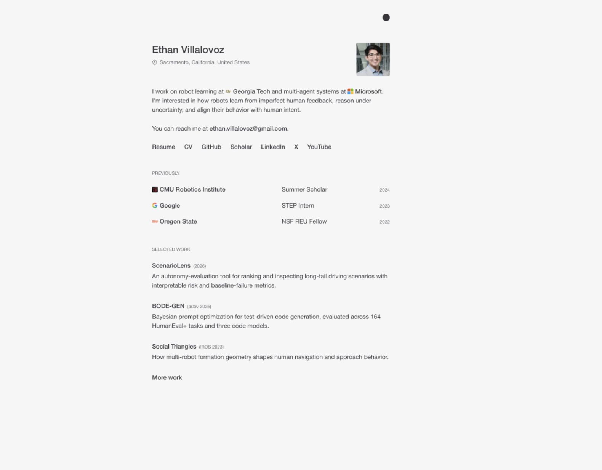

# Ethan Villalovoz Portfolio

Personal portfolio and research website for [ethanvillalovoz.com](https://ethanvillalovoz.com), built with Next.js, TypeScript, Tailwind CSS, and Vercel.

The repo is intentionally small around the main public surface:

- Home
- Publications
- Projects
- Teaching

Project microsites linked from the main pages are kept under `public/data/`, including the RAG capstone page and the Gaussian splatting project page.

## Preview



## Tech Stack

- Next.js App Router
- TypeScript
- Tailwind CSS
- Framer Motion
- next-themes
- next-sitemap
- Vercel

## Getting Started

```bash
git clone https://github.com/ethanvillalovoz/ethanvillalovoz.github.io.git
cd ethanvillalovoz.github.io
npm ci
npm run dev
```

Open [http://localhost:3000](http://localhost:3000).

## Scripts

```bash
npm run dev        # local development
npm run lint       # ESLint
npm run typecheck  # TypeScript
npm run build      # production build and sitemap generation
npm run check      # lint, typecheck, and build
```

## Project Structure

```text
src/app/
  page.tsx          # Home
  publications/     # Publications page
  projects/         # Projects page
  teaching/         # Teaching page
  layout.tsx        # Site metadata, nav, footer, structured data

src/components/
  Navbar.tsx
  Footer.tsx
  ThemeToggle.tsx
  ui/FadeIn.tsx

public/
  data/             # Resume, CV, papers, and static project microsites
  images/           # Site, project, and timeline images
  visuals/          # README screenshots
```

## Customizing The Template

To adapt this site for your own portfolio:

1. Update personal metadata in `src/app/layout.tsx`.
2. Replace content arrays in `src/app/page.tsx`, `src/app/projects/page.tsx`, `src/app/publications/page.tsx`, and `src/app/teaching/page.tsx`.
3. Replace images in `public/images/`.
4. Replace documents and static project pages in `public/data/`.
5. Update `siteUrl` in `next-sitemap.config.js`.
6. Configure your domain in Vercel.

## Routes

| Route | Purpose |
| --- | --- |
| `/` | Home, news, experience, education, featured work |
| `/publications/` | Research publications and preprints |
| `/projects/` | Technical project gallery |
| `/teaching/` | Teaching, mentoring, and talks |
| `/rag/` | Static senior-design RAG project page |
| `/gaussian-splatting-physics/` | Static Gaussian splatting project page |

## Deployment

The site is deployed on Vercel. The production build runs:

```bash
npm run build
```

`next-sitemap` generates `robots.txt` and `sitemap.xml` during the build using `https://ethanvillalovoz.com` as the canonical site URL.

## License

This project is available under the [MIT License](LICENSE).
