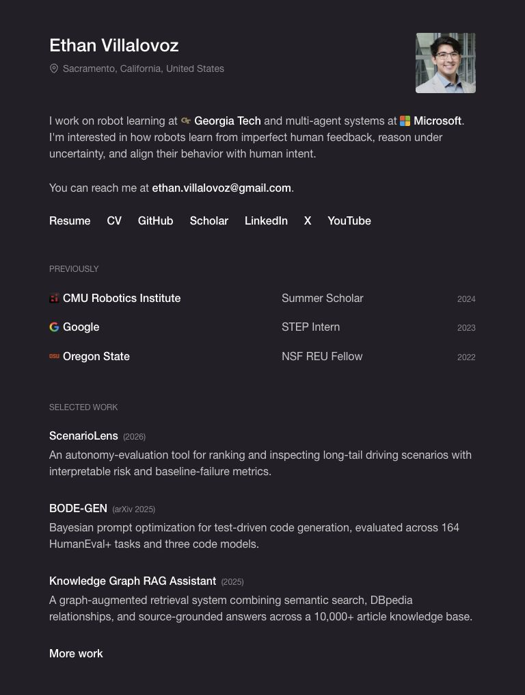

# Ethan Villalovoz Portfolio

[](https://github.com/ethanvillalovoz/ethanvillalovoz.github.io/actions/workflows/ci.yml)

Personal portfolio and research website for [ethanvillalovoz.com](https://ethanvillalovoz.com). The site presents a concise homepage, a reverse-chronological Work archive, technical writing, a Research page, and a small set of standalone project previews.



## Public Routes

| Route | Purpose |
| --- | --- |
| `/` | Introduction, experience, contact links, and selected work |
| `/writing/` | Technical notes and research writeups |
| `/writing/tests-turn-prompting-into-search/` | BODE-GEN evaluation essay |
| `/work/` | Unified archive of writing, research, and projects |
| `/research/` | Publications, paper resources, and teaching history |
| `/scenariolens/` | ScenarioLens interactive explorer |
| `/metricdrive/` | MetricDrive research preview |

Legacy `/projects/`, `/publications/`, and `/teaching/` URLs redirect to the current information architecture.

## Design And Content Model

The homepage is intentionally compact. It offers enough context to understand Ethan's current work, then points visitors toward deeper evidence.

Work uses one reverse-chronological feed with three supported content types:

- `Writing`
- `Research`
- `Project`

Writing belongs in that shared feed, using the same image, title, date/type, and concise-summary structure as the other entries. The Writing index contains only complete, substantive essays; it does not expose drafts or placeholder entries.

## Stack

- Next.js App Router
- React and TypeScript
- Plain CSS with light and dark themes
- `next-themes`
- `next-sitemap`
- Vercel

Standalone project previews under `public/` use dependency-free HTML, CSS, and JavaScript where practical.

## Discovery And Performance

- Route-specific canonical, Open Graph, and X metadata
- `ProfilePage`, `Blog`, `TechArticle`, `ScholarlyArticle`, and software-project JSON-LD
- XML sitemap coverage for every public route and its representative images
- Responsive `next/image` delivery for portfolio, research, and writing media
- Explicit image dimensions and lazy decoding for below-the-fold microsite figures
- Compact favicon-based sharing for the homepage and visual previews for standalone projects

## Local Development

Requirements:

- Node.js 20.9 or newer
- npm

The tested local and CI runtime is recorded in `.nvmrc`:

```bash
nvm use
```

```bash
git clone https://github.com/ethanvillalovoz/ethanvillalovoz.github.io.git
cd ethanvillalovoz.github.io
npm ci
npm run dev
```

Open [http://localhost:3000](http://localhost:3000).

## Scripts

```bash
npm run dev        # Start the local development server
npm run validate   # Check routes, assets, sitemap, and repository invariants
npm run lint       # Run ESLint
npm run typecheck  # Generate Next.js route types and run TypeScript
npm run build      # Build the site and regenerate sitemap files
npm run check      # Run validation, lint, typecheck, and production build
```

## Repository Structure

```text
src/app/
  page.tsx                    Home metadata and server entry
  (secondary)/layout.tsx      Shared header and footer
  (secondary)/writing/        Writing index and essays
  (secondary)/work/           Work archive
  (secondary)/research/       Publications and teaching

src/components/
  HomePageClient.tsx          Locked homepage experience
  Navbar.tsx                  Secondary navigation
  Footer.tsx                  Secondary footer
  ThemeToggle.tsx             Light/dark theme control

src/data/
  site.ts                     Canonical identity and metadata constants
  work.ts                     Work feed entries
  writing.ts                  Published essay metadata
  research.ts                 Publications and teaching records

public/
  data/                       Resume, CV, papers, and project evidence
  images/                     Identity, organization, and active project images
  metricdrive/                MetricDrive microsite
  scenariolens/               ScenarioLens microsite
  visuals/                    README screenshot

scripts/
  validate-repository.mjs     Repository integrity checks
```

See [Architecture](docs/ARCHITECTURE.md), [Design Contract](docs/DESIGN.md), and [Customization](docs/CUSTOMIZATION.md) for implementation details.

## Deployment

Vercel is the intended deployment target. The production command is:

```bash
npm run build
```

The build runs Next.js and then generates `robots.txt` and `sitemap.xml` for `https://ethanvillalovoz.com`.

## Contributing

Focused bug fixes, accessibility improvements, and documentation corrections are welcome. Read [CONTRIBUTING.md](CONTRIBUTING.md) before opening a pull request. Security reports should follow [SECURITY.md](SECURITY.md).

## License

The site code is available under the [MIT License](LICENSE). Research papers, project media, organization marks, and adapted third-party microsite material may have separate terms; see [THIRD_PARTY_NOTICES.md](THIRD_PARTY_NOTICES.md).
