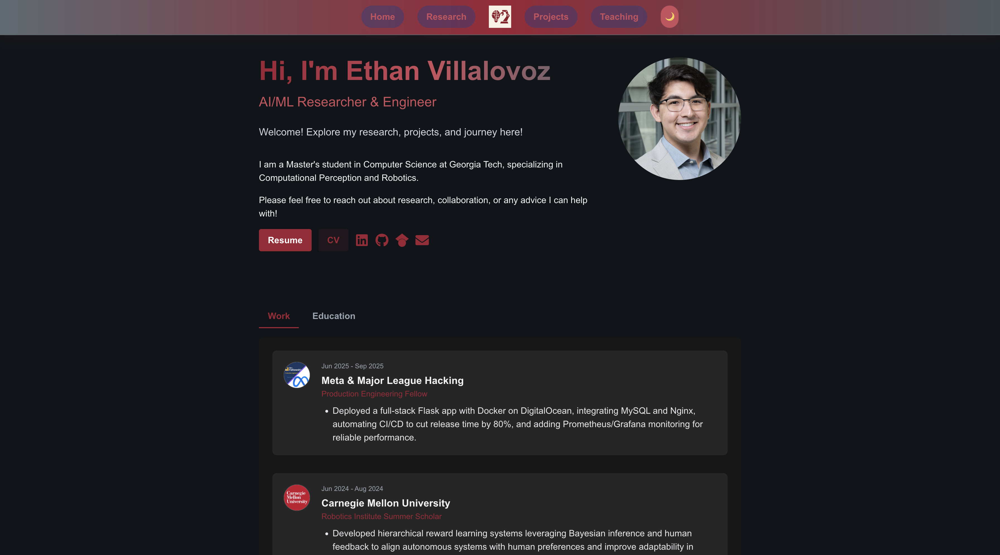

# Ethan Villalovoz Personal Website

[](https://vercel.com)
[](https://nextjs.org/)
[](https://www.typescriptlang.org/)
[](LICENSE)

---

## Table of Contents

- [Introduction](#introduction)
- [Description](#description)
- [Visuals](#visuals)
- [Features](#features)
- [Prerequisites](#prerequisites)
- [Technologies Used](#technologies-used)
- [QuickStart](#quickstart)
- [Usage](#usage)
- [Advanced Usage](#advanced-usage)
- [Configuration](#configuration)
- [Folder Structure](#folder-structure)
- [Automated Tests](#automated-tests)
- [Roadmap](#roadmap)
- [Contribution Guidelines](#contribution-guidelines)
- [Issue & Pull Request Templates](#issue--pull-request-templates)
- [Diagrams](#diagrams)
- [SOLID Principles](#solid-principles)
- [License](#license)

---

## Introduction

A modern, professional personal website built with Next.js and TypeScript. Designed for researchers, engineers, and professionals to showcase their work, research, and contact information.

---

## Description

This site features a responsive, card-based projects page, a vertical timeline for experience, and a contact page with copy-to-clipboard email and downloadable bio/CV. It is fully accessible, SEO-friendly, and easy to customize for your own use. The project is deployed on Vercel for seamless CI/CD.

---

## Visuals

<!-- Replace these with your own screenshots or GIFs -->


---

## Features

- Card-based, responsive grid for technical projects
- Vertical timeline for experience and education
- Downloadable and displayed bio/CV
- Copy-to-clipboard email with feedback
- Responsive navigation bar with mobile hamburger menu
- SEO: sitemap.xml and robots.txt auto-generation
- Fully responsive and accessible
- Easy to customize and extend

---

## Prerequisites

- Node.js v18+ (recommended: latest LTS)
- npm, yarn, pnpm, or bun (choose one)
- Git

---

## Technologies Used

- [Next.js (App Router)](https://nextjs.org/)
- [TypeScript](https://www.typescriptlang.org/)
- [Tailwind CSS](https://tailwindcss.com/)
- [Framer Motion](https://www.framer.com/motion/)
- [next-sitemap](https://github.com/iamvishnusankar/next-sitemap) (SEO)
- [Vercel](https://vercel.com/) (deployment)

---

## QuickStart

1. **Clone the repository:**
    ```bash
    git clone https://github.com/ethanvillalovoz/ethan-site-rebuild.git
    cd ethan-site-rebuild
    ```

2. **Install dependencies:**
    ```bash
    npm install
    # or
    yarn install
    # or
    pnpm install
    # or
    bun install
    ```

3. **Start the development server:**
    ```bash
    npm run dev
    # or
    yarn dev
    # or
    pnpm dev
    # or
    bun dev
    ```

4. **Open your browser:**  
   Visit [http://localhost:3000](http://localhost:3000)

---

## Usage

- Edit content in `src/app/` (e.g., `projects/page.tsx`, `about/page.tsx`, `contact/page.tsx`)
- Replace images in `public/images/` and documents in `public/data/`
- The site auto-updates as you save changes

---

## Advanced Usage

- **SEO:**  
  Regenerate `sitemap.xml` and `robots.txt` after adding/removing pages:
  ```bash
  npx next-sitemap
  ```
- **Custom Domains:**  
  Configure in the Vercel dashboard under your project’s "Domains" tab.
- **Environment Variables:**  
  Add secrets or API keys in Vercel dashboard or `.env.local` (see [Configuration](#configuration))

---

## Configuration

- Most configuration is handled via `next.config.js` and environment variables.
- To add environment variables, create a `.env.local` file:
    ```
    NEXT_PUBLIC_SITE_URL=https://your-site.vercel.app
    # Add other variables as needed
    ```
- For SEO, update `next-sitemap.config.js` as needed.

---

## Folder Structure

```
ethan-site-rebuild/
├── public/
│   ├── images/
│   ├── data/
│   ├── robots.txt
│   └── sitemap.xml
├── src/
│   ├── app/
│   ├── components/
│   ├── styles/
│   └── ...
├── .github/
│   ├── ISSUE_TEMPLATE/
│   └── PULL_REQUEST_TEMPLATE.md
├── README.md
├── LICENSE
├── next.config.js
├── tailwind.config.js
└── package.json
```

---

## Automated Tests

*No automated tests are included yet.*  
You can add your own tests using [Jest](https://jestjs.io/) or [React Testing Library](https://testing-library.com/).

---

## Roadmap

- [ ] Add blog section
- [ ] Add automated tests
- [ ] Improve accessibility and a11y testing
- [x] Add dark mode toggle
- [x] Enhance project filtering and search
- [x] Add more visuals and animations

---

## Contribution Guidelines

Contributions are welcome!  
To contribute:

1. Fork the repository
2. Create a new branch (`git checkout -b feature/your-feature`)
3. Commit your changes
4. Open a pull request

See [CONTRIBUTING.md](CONTRIBUTING.md) for more details.

---

## Issue & Pull Request Templates

- Use the templates in `.github/ISSUE_TEMPLATE/` for bug reports and feature requests.
- Pull requests should use `.github/PULL_REQUEST_TEMPLATE.md`.

---

## Diagrams

For architecture and workflow diagrams, use [Mermaid](https://mermaid-js.github.io/).

Example:


---

## SOLID Principles

This project aims to follow SOLID principles for maintainability:

- **Single Responsibility:** Each component does one thing.
- **Open/Closed:** Components are open for extension, closed for modification.
- **Liskov Substitution:** Components can be replaced by their subtypes.
- **Interface Segregation:** Prefer small, focused interfaces.
- **Dependency Inversion:** Depend on abstractions, not concretions.

---

## License

This project is open source and available under the [MIT License](LICENSE).

---
